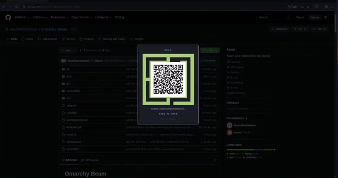

# Omarchy Beam

**Take any link and make it a scannable QR code — instantly.**

Copy a link (or pass it on the command line), press a shortcut, and a branded QR
appears in a clean, native Omarchy overlay. Scan it with any phone — the link
opens, the text copies, the number dials. That's the whole plugin.

```
Copy a link  →  Super + Shift + Q  →  Scan
        or:  omarchy-beam https://example.com
```

No pairing. No account. No cloud. No server. No network at all.

---

## Demo

A centered card on a dark scrim, styled with your current Omarchy theme, with the
QR code wrapped in the green Beam frame:

<p align="center">
  
</p>

Three ways to beam a link:

```bash
# 1. copy a link, then press Super + Shift + Q
# 2. pass it directly (no clipboard change; also prints the QR in the terminal):
omarchy-beam https://github.com/TouchWorkStation/Omarchy-Beam-
# 3. pipe it (terminal QR):
echo "https://example.com" | omarchy-beam -
```

## Why Beam?

Moving a link, a command, a Wi-Fi password, or a phone number from your desktop
to your phone is annoyingly hard for something so small. The usual answers —
messaging yourself, email drafts, a syncing service — all mean accounts, apps,
and your data leaving the machine.

Beam does the obvious thing: it shows the data as a QR code on your own screen.
Your phone's camera does the rest. Nothing is transmitted, stored, or uploaded —
the information travels as photons, monitor to camera.

## Installation

Beam is an Omarchy shell plugin.

```bash
omarchy plugin add https://github.com/TouchWorkStation/Omarchy-Beam-.git --enable
```

Then put the CLI on your PATH and see the keybinding to add:

```bash
~/.config/omarchy/plugins/beam/install.sh
```

`install.sh` only symlinks `omarchy-beam` into `~/.local/bin` and prints the
shortcut line — it never edits your Hyprland config.

<details>
<summary>Manual install (without the plugin manager)</summary>

```bash
git clone https://github.com/TouchWorkStation/Omarchy-Beam-.git \
  ~/.config/omarchy/plugins/beam
~/.config/omarchy/plugins/beam/install.sh
omarchy-shell shell rescanPlugins
omarchy-shell shell setPluginEnabled beam true
```
</details>

## Usage

1. Copy anything (a URL, a command, an email, a phone number, a Wi-Fi QR string).
2. Press **Super + Shift + Q** (or run `omarchy-beam`).
3. Scan the QR code with your phone.
4. Press **Esc** or click outside the card to close. Press the shortcut again to
   toggle it.

```bash
omarchy-beam                    # toggle the overlay for the current clipboard
omarchy-beam https://you.dev    # beam a link directly (also prints a terminal QR)
echo "text" | omarchy-beam -    # render a QR in the terminal, clipboard untouched
omarchy-beam --help
omarchy-beam --version
```

## Keyboard shortcut

`SUPER + SHIFT + Q` is unbound on a stock Omarchy install, so Beam does **not**
overwrite anything. Add it yourself in `~/.config/hypr/bindings.lua`:

```lua
o.bind("SUPER + SHIFT + Q", "Beam clipboard", "omarchy-beam")
```

Reload with `hyprctl reload`. Prefer a different key? Check what's taken first
with `omarchy menu keybindings --print`, then use `o.rebind(...)` if you're
replacing an existing binding. The command `omarchy-beam` always works directly,
with or without a shortcut.

## Supported content

Beam classifies the clipboard automatically and shows the matching action:

| Clipboard                         | Detected as | Action shown   |
| --------------------------------- | ----------- | -------------- |
| `https://github.com/omacom/omarchy` | URL       | **Scan to open** |
| `docker compose up -d`            | Plain text  | **Scan to copy** |
| `user@example.com` / `mailto:…`   | Email       | **Scan to email** |
| `tel:+15555555555`                | Telephone   | **Scan to call** |
| `WIFI:T:WPA;S:MyNet;P:secret;;`   | Wi-Fi QR    | **Scan to join** |

Detection is simple and deterministic — no AI, no guessing, no network.

### Copying plain text on your phone

A plain-text QR has no built-in action, so a phone's **stock Camera** treats it
as a web search instead of offering to copy it. That's a phone-OS behavior, not
a Beam limitation. Your options:

- **Use a scanner that copies text.** Google Lens, or a free open-source QR app
  like [Binary Eye](https://f-droid.org/packages/de.markusfisch.android.binaryeye/)
  (enable *Copy to clipboard* for true auto-copy). The saved-photo long-press
  also surfaces a Copy button.
- **Read it off the overlay.** Beam shows the full text under the QR.
- **Make the stock Camera prefill it (opt-in).** Set a text mode so plain text is
  encoded as a draft the camera *does* act on — nothing is sent, still 100%
  local:

  | Mode     | Scanning plain text opens…                    |
  | -------- | --------------------------------------------- |
  | `plain`  | raw text QR (default)                         |
  | `sms`    | Messages, with the text prefilled in the body |
  | `mailto` | Mail, with the text prefilled in the body     |

  Enable it with a config file (read by the overlay too):

  ```bash
  mkdir -p ~/.config/omarchy-beam
  echo mailto > ~/.config/omarchy-beam/text-mode   # or: sms
  ```

  Or per-run with the `BEAM_TEXT_MODE` environment variable (it overrides the
  file). Only plain text is affected — URLs, email, tel, and Wi-Fi are untouched.
  A QR can never write to a phone's clipboard on its own; this just gets the
  text somewhere copyable without a scanner app.

## Privacy

Privacy is the point.

- **Completely local.** Your clipboard never leaves the machine except visually,
  as the QR code you scan.
- **No** telemetry, analytics, API, cloud service, remote server, network
  request, account, or database — ever. Beam opens no ports and runs no server.
- **No history.** Beam only ever looks at what you hand it right now.
- **Nothing logged.** Clipboard contents are never printed to logs.
- Clipboard data is treated as untrusted input — it is only ever passed to
  `qrencode` on stdin, never interpolated into a shell command, and is never
  executed or evaluated.

## Security & scope

A quick, honest map of exactly what Beam can and can't do (see also
[`SECURITY.md`](SECURITY.md)):

- **Fully offline.** Turning a link into a QR makes zero network requests, opens
  no ports, and runs no server.
- **No config is ever overwritten.** Beam never edits your Hyprland config — it
  only *prints* the keybinding line for you to add yourself.
- **No privilege escalation.** Beam never escalates privilege (never runs as
  root or through a privilege helper). It never installs, upgrades, or removes
  packages; if a dependency is missing it only *tells* you the package to
  install.
- **No persisted data.** `omarchy-beam <link>` writes a single one-shot payload
  file under `$XDG_RUNTIME_DIR/omarchy-beam` (mode 600) that the overlay consumes
  and deletes on read; the toggle/clipboard path writes nothing at all.
- **`install.sh`** only symlinks `omarchy-beam` into `~/.local/bin` and prints
  the shortcut; **`uninstall.sh`** only removes that symlink (when it points at
  this plugin) and Beam's runtime state. Neither touches your shell or Hyprland
  config. Both are optional — the plugin works from its install directory.

## Requirements

Everything Beam needs already ships with Omarchy — there's nothing to install:

- `omarchy-shell` (the Omarchy Quickshell desktop)
- `wl-clipboard` (`wl-paste`)
- `qrencode`

Beam itself never installs anything. In the unlikely event a dependency is
missing, Beam prints the exact package name (`qrencode` or `wl-clipboard`) for
you to install with your usual package manager — it never runs a package manager
or elevates privilege for you.

## Troubleshooting

- **"omarchy-shell not found" / overlay doesn't appear** — Beam needs the Omarchy
  shell running. Confirm with `omarchy-shell shell ping`.
- **Nothing happens on the shortcut** — check the binding exists
  (`omarchy menu keybindings --print`) and that `omarchy-beam` is on your PATH
  (`command -v omarchy-beam`). Run `~/.config/omarchy/plugins/beam/install.sh`.
- **"Nothing to Beam"** — the clipboard is empty or holds a non-text item (like
  an image). Copy some text and try again.
- **"Too large to Beam"** — the clipboard is bigger than the payload limit
  (1200 bytes by default; raise it with `BEAM_MAX_BYTES`). Big payloads make a
  dense QR that phones can't reliably scan.
- **QR won't scan** — increase your screen brightness, and make sure the whole
  card is on screen. The QR is rendered fixed-white with a quiet zone precisely
  so it scans under any theme.
- **Scanning plain text does nothing on my phone** — a plain-text QR has no
  built-in action (unlike a URL, which opens, or `tel:`, which dials), so what
  happens depends on the scanner. Use **Google Lens** (Android) or the **stock
  iOS Camera** — both show the text with a **Copy** button. A basic third-party
  camera app may ignore non-URL codes. Beam also shows the full text under the
  QR on the overlay, so you can read or copy it directly on the desktop. (A QR
  cannot push text into a phone's clipboard on its own — that would require a
  URL and a server, which Beam deliberately avoids.)
- **Plugin not loading** — run `omarchy plugin validate .` in the plugin folder
  and `omarchy-shell shell rescanPlugins`.

## Uninstall

Run the teardown helper (unlinks the CLI and clears runtime state — it never
edits your Hyprland config or your clipboard history):

```bash
~/.config/omarchy/plugins/beam/uninstall.sh
omarchy plugin remove beam
```

Then delete the Beam `o.bind(…)` line(s) from `~/.config/hypr/bindings.lua`,
`hyprctl reload`, and optionally `rm -rf ~/.config/omarchy-beam` to drop your
preferences.

## Contributing

Issues and PRs welcome. Before opening a PR:

```bash
omarchy plugin validate .   # manifest passes the shell's own schema
test/beam_test.sh           # classification, previews, limits, QR round-trip
```

Please keep Beam focused: **turn a link into a beautiful, instantly scannable QR
code.** See `docs/OMARCHY_RESEARCH.md` for how Beam maps onto the current
Omarchy plugin architecture.

## License

[MIT](LICENSE) © TouchWorkStation
