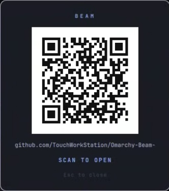

# Omarchy Beam

**Take any link and make it a scannable QR code — instantly.**

Copy a link (or pass it on the command line), press a shortcut, and a branded QR
appears in a clean, native Omarchy overlay. Scan it with any phone — the link
opens, the text copies, the number dials. That's the core of Beam.

```
Copy a link  →  Super + Shift + Q  →  Scan
        or:  omarchy-beam https://example.com
```

No pairing. No account. No cloud.

---

## Demo

A centered card on a dark scrim, styled with your current Omarchy theme, with the
Beam mark in the middle of the code:

<p align="center">
  
</p>

Three ways to beam a link:

```bash
# 1. copy a link, then press Super + Shift + Q
# 2. pass it directly (no clipboard change; also prints the QR in the terminal):
omarchy-beam https://github.com/TouchWorkStation/Omarchy-Beam-
# 3. pipe it (terminal QR):
echo "https://example.com" | omarchy-beam -
```

## Two modes, one plugin

- **Links (core, default):** copy or pass a link → QR. 100% local, no server, no
  dependencies beyond `qrencode` + `wl-clipboard`. This is all most people need.
- **Beam Link (optional module):** an opt-in local web server that serves your
  recent clipboard **history** as a page your phone can copy from, and a
  one-time **secret** mode for keys/passwords. Needs `python3`, runs only when
  you invoke `--link` / `--secret`, and can be turned off entirely (see
  [links-only](#links-only-mode)). *Status: stable core; history UX still being
  polished.*

## Why Beam?

Moving a link, a command, a Wi-Fi password, or a phone number from your desktop
to your phone is annoyingly hard for something so small. The usual answers —
messaging yourself, email drafts, a syncing service — all mean accounts, apps,
and your data leaving the machine.

Beam does the obvious thing: it shows the data as a QR code on your own screen.
Your phone's camera does the rest. In the core links mode nothing is transmitted,
stored, or uploaded — the information travels as photons, monitor to camera.

## Installation

Beam is an Omarchy shell plugin.

```bash
omarchy plugin add https://github.com/TouchWorkStation/Omarchy-Beam-.git --enable
```

Then put the CLI on your PATH and see the keybinding to add:

```bash
~/.config/omarchy/plugins/beam/install.sh
```

`install.sh` only symlinks `omarchy-beam` into `~/.local/bin` and prints the
shortcut line — it never edits your Hyprland config.

<details>
<summary>Manual install (without the plugin manager)</summary>

```bash
git clone https://github.com/TouchWorkStation/Omarchy-Beam-.git \
  ~/.config/omarchy/plugins/beam
~/.config/omarchy/plugins/beam/install.sh
omarchy-shell shell rescanPlugins
omarchy-shell shell setPluginEnabled beam true
```
</details>

## Usage

1. Copy anything (a URL, a command, an email, a phone number, a Wi-Fi QR string).
2. Press **Super + Shift + Q** (or run `omarchy-beam`).
3. Scan the QR code with your phone.
4. Press **Esc** or click outside the card to close. Press the shortcut again to
   toggle it.

```bash
omarchy-beam                    # toggle the overlay for the current clipboard
omarchy-beam https://you.dev    # beam a link directly (also prints a terminal QR)
echo "text" | omarchy-beam -    # render a QR in the terminal, clipboard untouched
omarchy-beam --help
omarchy-beam --version
```

### Links-only mode

The clipboard-history web server is optional and off unless you run `--link` /
`--secret`. To make the plugin **links-only** (and refuse those commands
entirely — e.g. on a shared or locked-down machine):

```bash
mkdir -p ~/.config/omarchy-beam && touch ~/.config/omarchy-beam/links-only
# or per-run: BEAM_DISABLE_LINK=1
```

## Keyboard shortcut

`SUPER + SHIFT + Q` is unbound on a stock Omarchy install, so Beam does **not**
overwrite anything. Add it yourself in `~/.config/hypr/bindings.lua`:

```lua
o.bind("SUPER + SHIFT + Q", "Beam clipboard", "omarchy-beam")
```

Reload with `hyprctl reload`. Prefer a different key? Check what's taken first
with `omarchy menu keybindings --print`, then use `o.rebind(...)` if you're
replacing an existing binding. The command `omarchy-beam` always works directly,
with or without a shortcut.

## Supported content

Beam classifies the clipboard automatically and shows the matching action:

| Clipboard                         | Detected as | Action shown   |
| --------------------------------- | ----------- | -------------- |
| `https://github.com/omacom/omarchy` | URL       | **Scan to open** |
| `docker compose up -d`            | Plain text  | **Scan to copy** |
| `user@example.com` / `mailto:…`   | Email       | **Scan to email** |
| `tel:+15555555555`                | Telephone   | **Scan to call** |
| `WIFI:T:WPA;S:MyNet;P:secret;;`   | Wi-Fi QR    | **Scan to join** |

Detection is simple and deterministic — no AI, no guessing, no network.

### Copying plain text on your phone

A plain-text QR has no built-in action, so a phone's **stock Camera** treats it
as a web search instead of offering to copy it. That's a phone-OS behavior, not
a Beam limitation. Your options:

- **Use a scanner that copies text.** Google Lens, or a free open-source QR app
  like [Binary Eye](https://f-droid.org/packages/de.markusfisch.android.binaryeye/)
  (enable *Copy to clipboard* for true auto-copy). The saved-photo long-press
  also surfaces a Copy button.
- **Read it off the overlay.** Beam shows the full text under the QR.
- **Make the stock Camera prefill it (opt-in).** Set a text mode so plain text is
  encoded as a draft the camera *does* act on — nothing is sent, still 100%
  local:

  | Mode     | Scanning plain text opens…                    |
  | -------- | --------------------------------------------- |
  | `plain`  | raw text QR (default)                         |
  | `sms`    | Messages, with the text prefilled in the body |
  | `mailto` | Mail, with the text prefilled in the body     |

  Enable it with a config file (read by the overlay too):

  ```bash
  mkdir -p ~/.config/omarchy-beam
  echo mailto > ~/.config/omarchy-beam/text-mode   # or: sms
  ```

  Or per-run with the `BEAM_TEXT_MODE` environment variable (it overrides the
  file). Only plain text is affected — URLs, email, tel, and Wi-Fi are untouched.
  A QR can never write to a phone's clipboard on its own; this just gets the
  text somewhere copyable without a scanner app.

## Beam Link (opt-in) — copy from a page instead of a QR

Some things don't fit a QR, or you want to copy *history*, not just one item.
**Beam Link** serves your recent clipboard entries as a small web page **on your
own machine**, reachable over your Wi-Fi:

```bash
omarchy-beam --link        # asks how many entries to share, then shows a QR
omarchy-beam --link 10     # share the last 10 (skip the prompt)
omarchy-beam --link current # just the current clipboard
omarchy-beam --link all    # full history
```

Scan the QR (any camera — it's a normal URL) → your phone opens a page listing
those entries, each with a **Copy** button and tap-to-select. Bind it to a key
too, e.g.:

```lua
o.bind("SUPER + SHIFT + V", "Beam Link", "omarchy-beam --link")
```

### Secret mode (one-time) — for keys and passwords

```bash
omarchy-beam --secret
```

Same local mechanism, hardened for sensitive data:

- **Current clipboard only** — never reads history, so old secrets can't leak.
- **One-time:** the server serves the page **once** and immediately closes, so
  the link can't be reopened or replayed. The phone keeps the loaded page.
- **Short TTL** (`BEAM_SECRET_TTL`, default 45s) if it's never scanned.
- The overlay shows **"One-time secret — scan once"** and the phone page shows a
  closed-link banner.

The secret is **not** in the QR itself (the QR only holds the local URL), so a
bystander photographing your screen doesn't get it. It does travel over your LAN
in the clear (plain `http`) — fine on a home network, not on a hostile one. For
true end-to-end-encrypted transfer across networks, see the roadmap.

**How it stays local:** the page is served by a tiny web server running on your
computer, bound to your LAN address behind an unguessable token in the URL. It
**self-expires** after a few minutes (`BEAM_LINK_TTL`, default 180s) and stops
when you close the overlay. Nothing is uploaded to any cloud.

**Know the trade-offs** (that's why it's opt-in, never the default):
- Phone and desktop must be on the **same Wi-Fi**.
- It exposes clipboard **history** to anyone who has the link while it's live.
- The one-tap Copy button is best-effort over plain `http` (browsers restrict
  the clipboard API on non-`https` origins); tap-to-select always works.
- Reads Omarchy's existing clipboard history
  (`~/.local/state/omarchy/clipboard-history.json`); if that's empty it serves
  just the current clipboard. Requires `python3`. The count picker uses
  `walker` (or `fuzzel`/`wofi`/…); with none installed it uses a default of 5
  (set it in `~/.config/omarchy-beam/link-count`).
- The URL shows your auto-detected LAN IP. Detection prefers a real private LAN
  address and skips Tailscale/CGNAT (`100.64/10`) and loopback, so a VPN
  shouldn't hijack it. If it still picks the wrong one (Docker, several NICs),
  set it yourself: `export BEAM_LINK_HOST=192.168.x.y` (find it with
  `ip -4 addr`). The overlay prints the IP under the QR so you can check at a
  glance.

## Privacy

Privacy is the point.

- **Completely local.** In the default QR mode your clipboard never leaves the
  machine except visually, as the QR code you scan.
- **No** telemetry, analytics, API, cloud service, remote server, account, or
  database — ever.
- **The one network exception is Beam Link**, and only when *you* invoke it: it
  serves data over your own LAN (never a third-party/cloud), behind a tokened,
  self-expiring local URL. The default QR mode makes no network requests at all.
- **No temp files** for the clipboard: the QR is drawn as native rectangles in
  the shell, not written to disk.
- **Nothing logged.** Clipboard contents are never printed to logs.
- Clipboard data is treated as untrusted input — it is only ever passed to
  `qrencode` on stdin, never interpolated into a shell command, and is never
  executed or evaluated.

## Security & scope

A quick, honest map of exactly what Beam can and can't do (see also
[`SECURITY.md`](SECURITY.md)):

- **No config is ever overwritten.** Beam never edits your Hyprland config — it
  only *prints* the keybinding line for you to add yourself.
- **No privilege escalation.** Beam never escalates privilege (never runs as
  root or through a privilege helper). It never
  installs, upgrades, or removes packages; if a dependency is missing it only
  *tells* you the package to install.
- **Core links mode is offline.** Turning a link into a QR makes zero network
  requests and writes no temp files.
- **`install.sh`** only symlinks `omarchy-beam` into `~/.local/bin` and prints
  the shortcut; **`uninstall.sh`** only removes that symlink (when it points at
  this plugin) and Beam's runtime state. Neither touches your shell or Hyprland
  config. Both are optional — the plugin works from its install directory.
- **Beam Link** (`--link` / `--secret`, opt-in, *work in progress*) is the only
  networked feature. When *you* invoke it, a local `python3` server binds your
  **LAN** address behind an unguessable token, self-expires on a TTL (and after
  a single fetch in `--secret`), never uploads to any cloud, and never logs
  clipboard contents. It can be disabled entirely — see
  [Links-only mode](#links-only-mode).

## Requirements

Everything Beam needs already ships with Omarchy — there's nothing to install:

- `omarchy-shell` (the Omarchy Quickshell desktop)
- `wl-clipboard` (`wl-paste`)
- `qrencode`
- `python3` — used **only** by the optional Beam Link module (`--link`); the QR
  links core never needs it.

Beam itself never installs anything. In the unlikely event a dependency is
missing, Beam prints the exact package name (`qrencode`, `wl-clipboard`, or
`python3`) for you to install with your usual package manager — it never runs a
package manager or elevates privilege for you.

## Troubleshooting

- **"omarchy-shell not found" / overlay doesn't appear** — Beam needs the Omarchy
  shell running. Confirm with `omarchy-shell shell ping`.
- **Nothing happens on the shortcut** — check the binding exists
  (`omarchy menu keybindings --print`) and that `omarchy-beam` is on your PATH
  (`command -v omarchy-beam`). Run `~/.config/omarchy/plugins/beam/install.sh`.
- **"Nothing to Beam"** — the clipboard is empty or holds a non-text item (like
  an image). Copy some text and try again.
- **"Too large to Beam"** — the clipboard is bigger than the payload limit
  (1200 bytes by default; raise it with `BEAM_MAX_BYTES`). Big payloads make a
  dense QR that phones can't reliably scan.
- **QR won't scan** — increase your screen brightness, and make sure the whole
  card is on screen. The QR is rendered fixed-white with a quiet zone precisely
  so it scans under any theme.
- **Scanning plain text does nothing on my phone** — a plain-text QR has no
  built-in action (unlike a URL, which opens, or `tel:`, which dials), so what
  happens depends on the scanner. Use **Google Lens** (Android) or the **stock
  iOS Camera** — both show the text with a **Copy** button. A basic third-party
  camera app may ignore non-URL codes. Beam also shows the full text under the
  QR on the overlay, so you can read or copy it directly on the desktop. (A QR
  cannot push text into a phone's clipboard on its own — that would require a
  URL and a server, which Beam deliberately avoids.)
- **Plugin not loading** — run `omarchy plugin validate .` in the plugin folder
  and `omarchy-shell shell rescanPlugins`.
- **"could not start the Beam Link server"** — run `omarchy-beam --link-doctor`.
  It starts the server in the foreground and prints its URL or the exact error
  (e.g. missing `python3`), plus your host's IP addresses. (Fixed in v0.3.5: on
  hosts with a VPN such as Tailscale, the server used to stall on a reverse-DNS
  lookup at bind time — update if you're on an older version.)
- **See exactly what the phone does** — run the server in the foreground with
  request logging and scan it: `~/.config/omarchy/plugins/beam/bin/omarchy-beam-serve --count 3 --ttl 300 --verbose`.
  It prints the URL and logs each hit (`[beam] GET from <ip> -> 200`). If your
  phone's request never appears, it never reached the desktop (scanner didn't
  open the link, or a network/firewall issue); if it shows `-> 200`, the page
  was served and the problem is on the phone's rendering side.
- **Beam Link page won't open on my phone** — check, in order:
  1. **Same Wi-Fi?** Phone and desktop must be on the same network (and not a
     "guest" SSID — those often isolate devices from each other).
  2. **Right IP?** Look at the address under the QR. Compare with `ip -4 addr`
     on the desktop. If it's a VPN/Docker/`127.` address, set the real one:
     `export BEAM_LINK_HOST=192.168.x.y` (and re-run, or put it in your shell
     profile / the keybind: `env BEAM_LINK_HOST=192.168.x.y omarchy-beam --link`).
  3. **Server up?** On the desktop, `curl -s -o /dev/null -w '%{http_code}\n' "<the URL under the QR>"` should print `200`.
  4. **Firewall?** If curl works locally but the phone times out, a firewall is
     blocking the port — allow your LAN subnet through it (e.g. a `ufw` rule for
     `192.168.0.0/16`). Omarchy has no firewall by default, so this is rare.

## Uninstall

Run the teardown helper (unlinks the CLI, stops any Beam Link server, clears
runtime state — it never edits your Hyprland config or your clipboard history):

```bash
~/.config/omarchy/plugins/beam/uninstall.sh
omarchy plugin remove beam
```

Then delete the Beam `o.bind(…)` line(s) from `~/.config/hypr/bindings.lua`,
`hyprctl reload`, and optionally `rm -rf ~/.config/omarchy-beam` to drop your
preferences.

## Contributing

Issues and PRs welcome. Before opening a PR:

```bash
omarchy plugin validate .   # manifest passes the shell's own schema
test/beam_test.sh           # classification, previews, limits, QR round-trip
```

Please keep V0.1 focused: **turn the current clipboard into a beautiful,
instantly scannable QR code.** See `docs/OMARCHY_RESEARCH.md` for how Beam maps
onto the current Omarchy plugin architecture.

## License

[MIT](LICENSE) © TouchWorkStation
